<table width="100%" cellspacing="0" cellpadding="20">
  <tr>
    <td width="22%" valign="middle" align="center">
      
      <br>
      <p align="center" style="margin:0;">
      
    </p>
    </td>
    <td width="78%" valign="middle" align="center">
      <p align="center"><strong>VERSIÓN DE DEMOSTRACIÓN</strong></p>
      <p align="center"><sub>Vista previa de alta fidelidad del UI/UX de LocalSnips — explora la interfaz completa directamente en tu navegador.</sub></p>
      <p align="center">
        
      </p>
    </td>
  </tr>
</table>

<br>

---

## Navegación Rápida

<p align="center">
  <a href="#características"></a>
  <a href="#limitaciones"></a>
  <a href="#requisitos-previos"></a>
  <a href="#demo-en-vivo"></a>
</p>

<details>
<summary><strong>📑 Tabla de Contenidos Completa</strong></summary>

#### Características

- [Navegación Rápida](#navegación-rápida)
  - [Características](#características)
  - [Técnico](#técnico)
  - [Acerca de](#acerca-de)
- [Características](#características-1)
  - [1. Navegación y Barra Lateral](#1-navegación-y-barra-lateral)
  - [2. Vista Principal (Lista de Snippets)](#2-vista-principal-lista-de-snippets)
  - [3. Vista de Detalle del Elemento](#3-vista-de-detalle-del-elemento)
  - [4. Visualización (Vista de Grafo)](#4-visualización-vista-de-grafo)
  - [5. Generadores y Herramientas](#5-generadores-y-herramientas)
  - [6. Paleta de Comandos (⌘K)](#6-paleta-de-comandos-k)
  - [7. Configuración de Apariencia](#7-configuración-de-apariencia)
  - [8. Gestor de Servicios (Vista Previa - Control del Stack)](#8-gestor-de-servicios-vista-previa---control-del-stack)
  - [9. Resolución de Conflictos](#9-resolución-de-conflictos)
  - [10. Soporte Móvil](#10-soporte-móvil)
- [Limitaciones](#limitaciones)
- [Requisitos Previos](#requisitos-previos)
- [Acerca de Este Repositorio](#acerca-de-este-repositorio)
- [Demo en Vivo](#demo-en-vivo)
- [Propiedad y Licencia](#propiedad-y-licencia)
- [Aviso de Propiedad Intelectual](#aviso-de-propiedad-intelectual)

#### Técnico

- [Limitaciones](#limitaciones)
- [Requisitos Previos](#requisitos-previos)
  - [Requisitos del Sistema](#requisitos-del-sistema)
  - [Puertos de Red](#puertos-de-red)
  - [Configuración del Proveedor de IA](#configuración-del-proveedor-de-ia)

#### Acerca de

- [Acerca de Este Repositorio](#acerca-de-este-repositorio)
- [Demo en Vivo](#demo-en-vivo)
- [Propiedad y Licencia](#propiedad-y-licencia)

</details>

---

## Características

<p align="center" style="margin:0;">
  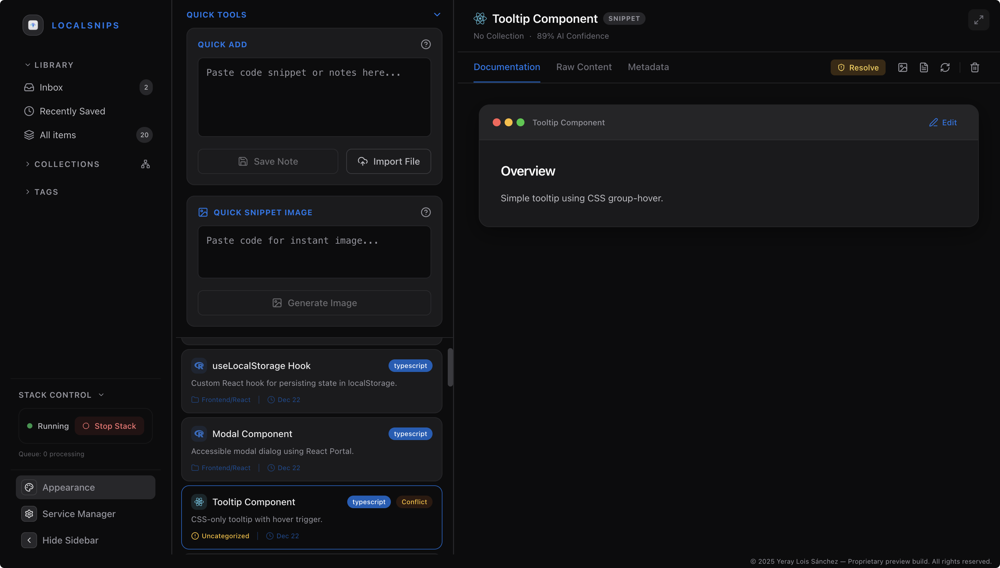
</p>
<p align="center" style="margin:6px 0 0;">
  <sub><strong>Vista General de la App</strong> — Punto de entrada principal mostrando la interfaz de biblioteca de snippets</sub>
</p>

### 1. Navegación y Barra Lateral

<table align="center">
  <tr>
    <td width="20%" valign="middle" align="center">
      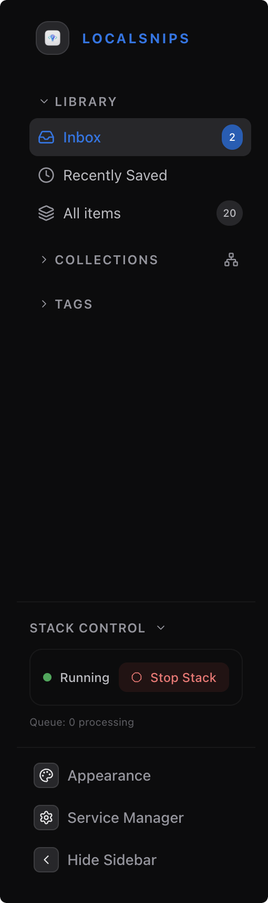
    </td>
    <td width="80%" valign="middle" align="center">
      <table
        cellspacing="0"
        cellpadding="0"
        style="
          width:100%;
          margin:0 auto;
          border:1px solid rgba(127,127,127,.35);
          border-radius:12px;
          overflow:hidden;
          border-collapse:separate;
          border-spacing:0;
        "
      >
        <tr>
          <td style="padding:10px 12px; border-bottom:1px solid rgba(127,127,127,.18); white-space:nowrap;">
            📥 <strong>Inbox</strong>
          </td>
          <td style="padding:10px 12px; border-bottom:1px solid rgba(127,127,127,.18);">
            Elementos pendientes de categorizar
          </td>
        </tr>
        <tr>
          <td style="padding:10px 12px; border-bottom:1px solid rgba(127,127,127,.18); white-space:nowrap;">
            🕐 <strong>Recently Saved</strong>
          </td>
          <td style="padding:10px 12px; border-bottom:1px solid rgba(127,127,127,.18);">
            Últimos N elementos (configurable)
          </td>
        </tr>
        <tr>
          <td style="padding:10px 12px; border-bottom:1px solid rgba(127,127,127,.18); white-space:nowrap;">
            📚 <strong>All Items</strong>
          </td>
          <td style="padding:10px 12px; border-bottom:1px solid rgba(127,127,127,.18);">
            Base de datos completa de snippets
          </td>
        </tr>
        <tr>
          <td style="padding:10px 12px; border-bottom:1px solid rgba(127,127,127,.18); white-space:nowrap;">
            📁 <strong>Collections</strong>
          </td>
          <td style="padding:10px 12px; border-bottom:1px solid rgba(127,127,127,.18);">
            Vista de carpetas jerárquica
          </td>
        </tr>
        <tr>
          <td style="padding:10px 12px; border-bottom:1px solid rgba(127,127,127,.18); white-space:nowrap;">
            🏷️ <strong>Tags</strong>
          </td>
          <td style="padding:10px 12px; border-bottom:1px solid rgba(127,127,127,.18);">
            Filtrar por etiquetas específicas
          </td>
        </tr>
        <tr>
          <td style="padding:10px 12px; border-bottom:1px solid rgba(127,127,127,.18); white-space:nowrap;">
            🎨 <strong>Appearance</strong>
          </td>
          <td style="padding:10px 12px; border-bottom:1px solid rgba(127,127,127,.18);">
            Panel de personalización de temas
          </td>
        </tr>
        <tr>
          <td style="padding:10px 12px; white-space:nowrap;">
            ⚙️ <strong>Service Manager</strong>
          </td>
          <td style="padding:10px 12px;">
            Página de control del Stack
          </td>
        </tr>
      </table>
    </td>
  </tr>
</table>

---

### 2. Vista Principal (Lista de Snippets)

La vista principal muestra tu biblioteca de snippets con herramientas de acceso rápido.

<table>
  <tr>
    <td width="50%" valign="top">
      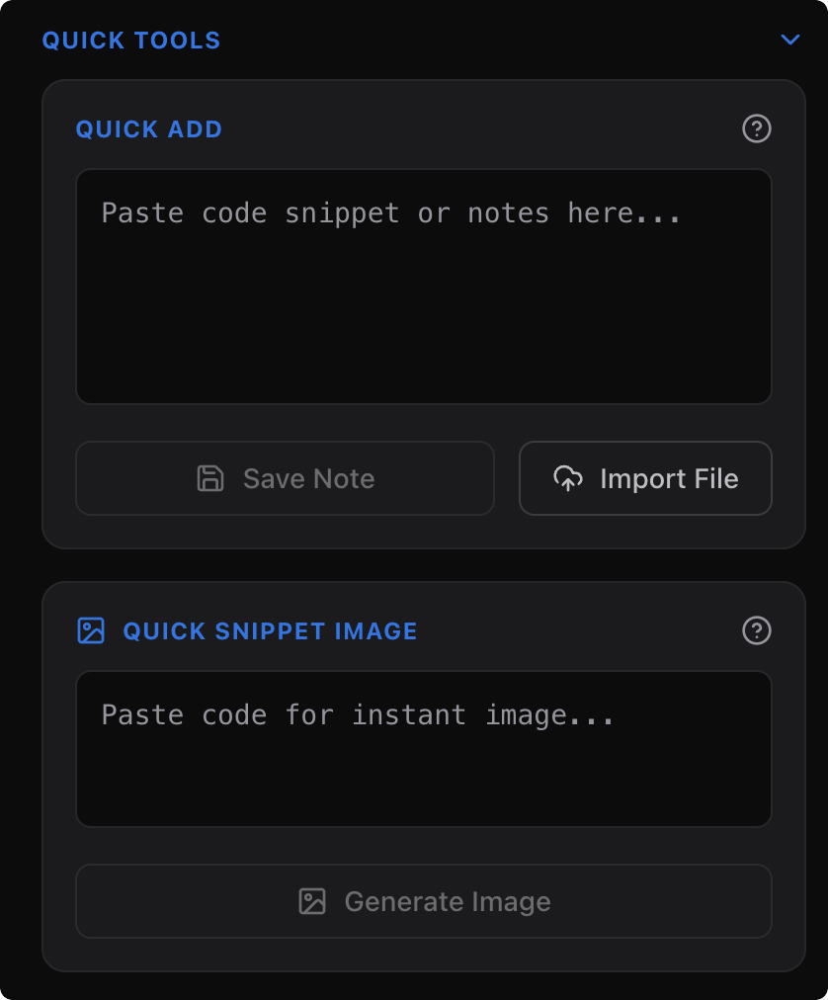
      <p align="center"><sub><strong>Herramientas Rápidas</strong> — Importación y generación de imágenes</sub></p>
    </td>
    <td width="50%" valign="top">
      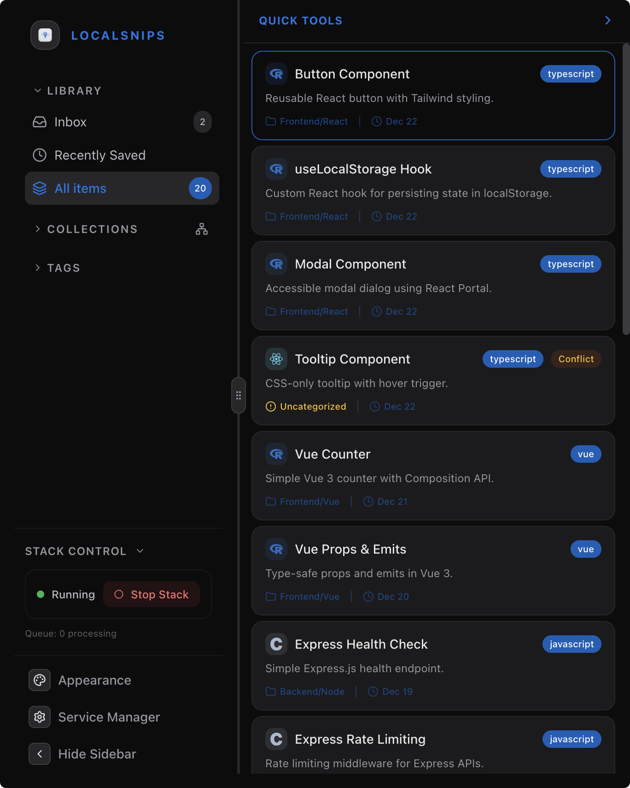
      <p align="center"><sub><strong>Lista de Snippets</strong> — Insignias de estado e iconos de tecnología</sub></p>
    </td>
  </tr>
</table>

<table
  align="center"
  cellspacing="0"
  cellpadding="8"
  style="
    border:1px solid rgba(127,127,127,.35);
    border-radius:12px;
    overflow:hidden;
    border-collapse:separate;
    border-spacing:0;
  "
>
  <tr>
    <th style="padding:10px 12px; border-bottom:1px solid rgba(127,127,127,.25); text-align:center; vertical-align:middle; white-space:nowrap;">
      Característica
    </th>
    <th style="padding:10px 12px; border-bottom:1px solid rgba(127,127,127,.25); text-align:center; vertical-align:middle; white-space:nowrap;">
      Descripción
    </th>
  </tr>

  <tr>
    <td align="center" style="padding:10px 12px; border-bottom:1px solid rgba(127,127,127,.18); white-space:nowrap;">
      <strong>Quick Add</strong>
    </td>
    <td align="center" style="padding:10px 12px; border-bottom:1px solid rgba(127,127,127,.18);">
      Pegar código/notas directamente o arrastrar archivos
    </td>
  </tr>

  <tr>
    <td align="center" style="padding:10px 12px; border-bottom:1px solid rgba(127,127,127,.18); white-space:nowrap;">
      <strong>Quick Snippet Image</strong>
    </td>
    <td align="center" style="padding:10px 12px; border-bottom:1px solid rgba(127,127,127,.18);">
      Generar imágenes de código sin guardar en biblioteca
    </td>
  </tr>

  <tr>
    <td align="center" style="padding:10px 12px; border-bottom:1px solid rgba(127,127,127,.18); white-space:nowrap;">
      <strong>Indicadores de Estado</strong>
    </td>
    <td align="center" style="padding:10px 12px; border-bottom:1px solid rgba(127,127,127,.18);">
      Conflicto, En cola, Procesando, Fallido
    </td>
  </tr>

  <tr>
    <td align="center" style="padding:10px 12px; white-space:nowrap;">
      <strong>Insignias de Tecnología</strong>
    </td>
    <td align="center" style="padding:10px 12px;">
      Iconos de lenguaje/framework auto-detectados
    </td>
  </tr>
</table>

---

### 3. Vista de Detalle del Elemento

Vista detallada para inspeccionar y editar snippets individuales.

<table width="100%" cellspacing="0" cellpadding="6">
  <tr>
    <td width="46%" valign="top" align="center">
      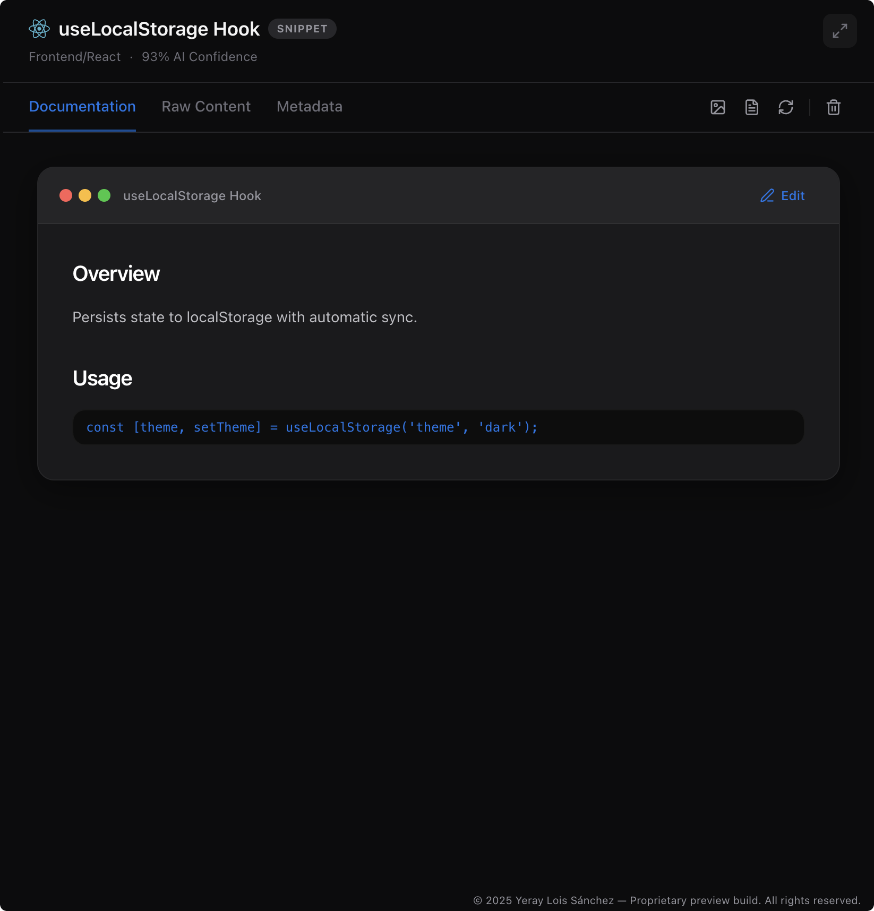
      <p align="center" style="margin:8px 0 0;">
        <sub><strong>Cabecera</strong> — Título, Tipo, Icono de Tecnología, Colección, Confianza de IA</sub>
      </p>
    </td>
    <td width="54%" valign="top">
      <h4 style="margin:0 0 8px;"><strong>Pestañas</strong></h4>
      <p align="center" style="margin:0;">
      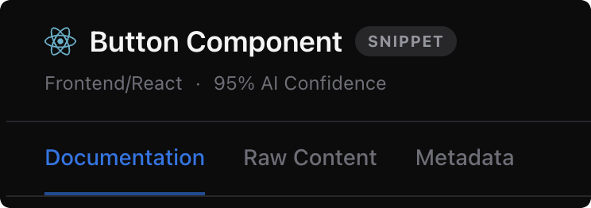
      </p>
      <br>
      <table
        align="center"
        cellspacing="0"
        cellpadding="8"
        style="
          margin:0 auto;
          border:1px solid rgba(127,127,127,.35);
          border-radius:12px;
          overflow:hidden;
          border-collapse:separate;
          border-spacing:0;
          width:92%;
          max-width:560px;
        "
      >
        <tr>
          <td style="padding:10px 12px; border-bottom:1px solid rgba(127,127,127,.18); white-space:nowrap;">
            <strong>Documentation</strong>
          </td>
          <td style="padding:10px 12px; border-bottom:1px solid rgba(127,127,127,.18);">
            Edición Markdown con vista previa
          </td>
        </tr>
        <tr>
          <td style="padding:10px 12px; border-bottom:1px solid rgba(127,127,127,.18); white-space:nowrap;">
            <strong>Raw Content</strong>
          </td>
          <td style="padding:10px 12px; border-bottom:1px solid rgba(127,127,127,.18);">
            Código de solo lectura con copiar
          </td>
        </tr>
        <tr>
          <td style="padding:10px 12px; white-space:nowrap;">
            <strong>Metadata</strong>
          </td>
          <td style="padding:10px 12px;">
            Editar etiquetas, colección, tecnología
          </td>
        </tr>
      </table>
      <br>
      <h4 style="margin:0 0 8px;"><strong>Acciones</strong></h4>
      <p align="center" style="margin:0;">
        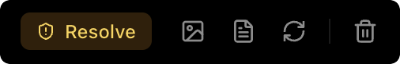
        <br>
        <sub>Resolver Conflicto · Captura · Póster · Reprocesar · Eliminar</sub>
      </p>
    </td>
  </tr>
</table>

---

### 4. Visualización (Vista de Grafo)

Grafo de conocimiento interactivo para explorar relaciones entre snippets.

<table>
  <tr>
    <td width="60%" valign="top">
      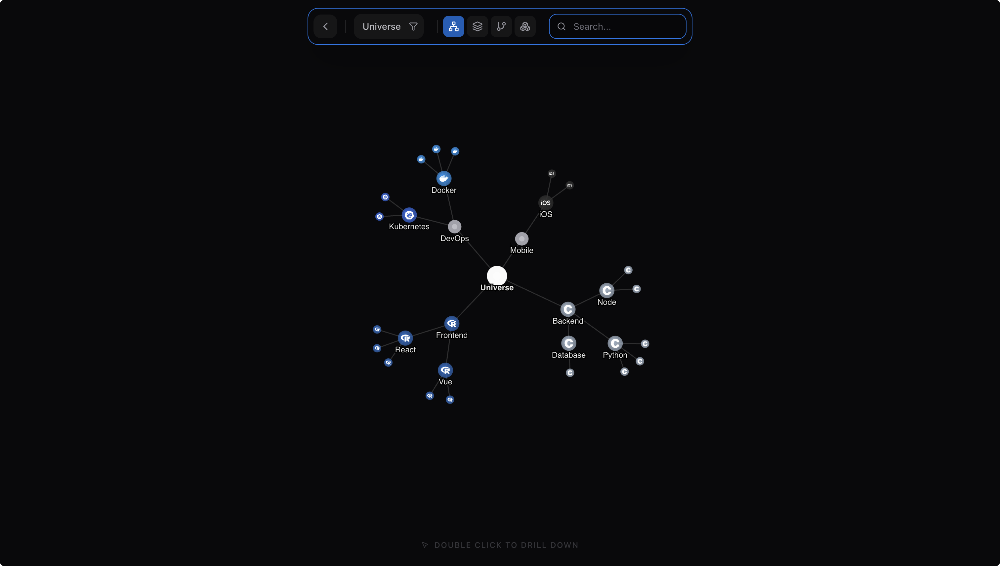
      <p align="center"><sub><strong>Grafo Neural</strong> — Visualización dirigida por fuerzas</sub></p>
    </td>
    <td width="40%" valign="top" >
      <h4><strong>Modos de Vista</strong></h4>
      <table
        align="center"
        cellspacing="0"
        cellpadding="8"
        style="
          width:100%;
          margin:0 auto;
          border:1px solid rgba(127,127,127,.35);
          border-radius:12px;
          overflow:hidden;
          border-collapse:separate;
          border-spacing:0;
        "
      >
        <tr><td>🧠 <strong>Neural</strong></td><td>Grafo basado en física</td></tr>
        <tr><td>➡️ <strong>Horizontal</strong></td><td>Flujo izquierda-derecha</td></tr>
        <tr><td>⬇️ <strong>Jerárquico</strong></td><td>Árbol de arriba-abajo</td></tr>
        <tr><td>⬆️ <strong>Inverso</strong></td><td>Árbol invertido</td></tr>
      </table>
      <br>
      <h4><strong>Controles</strong></h4>
      <p align="center" style="margin:0;">
        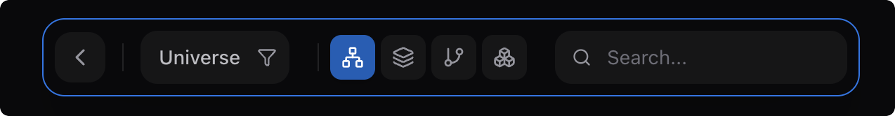
        <sub>Profundizar · Buscar · Selector de Raíz</sub>
      </p>
    </td>
  </tr>
</table>

---

### 5. Generadores y Herramientas

<table>
  <tr>
    <td width="50%" valign="top">
      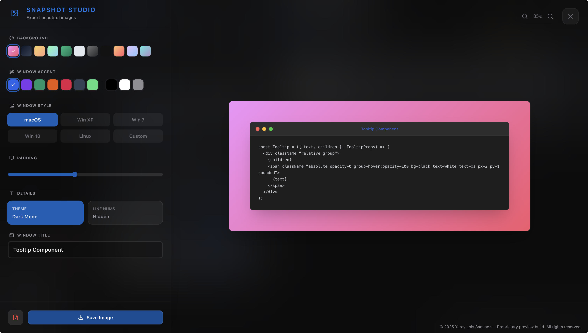
      <p align="center"><sub><strong>Estudio de Captura</strong> — Generador de Código a Imagen</sub></p>
    </td>
    <td width="50%" valign="top">
      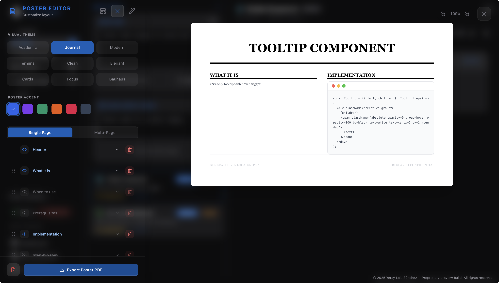
      <p align="center"><sub><strong>Modal de Póster</strong> — Exportación PDF</sub></p>
    </td>
  </tr>
</table>

<table
  align="center"
  cellspacing="0"
  cellpadding="8"
  style="
    border:1px solid rgba(127,127,127,.35);
    border-radius:12px;
    overflow:hidden;
    border-collapse:separate;
    border-spacing:0;
  "
>
  <tr>
    <th style="padding:10px 12px; border-bottom:1px solid rgba(127,127,127,.25); text-align:center; vertical-align:middle;">
      Herramienta
    </th>
    <th style="padding:10px 12px; border-bottom:1px solid rgba(127,127,127,.25); text-align:center; vertical-align:middle;">
      Opciones
    </th>
  </tr>

  <tr>
    <td align="center" style="padding:10px 12px; border-bottom:1px solid rgba(127,127,127,.18); white-space:nowrap;">
      <strong>Fondos</strong>
    </td>
    <td align="center" style="padding:10px 12px; border-bottom:1px solid rgba(127,127,127,.18);">
      Candy, Midnight, Sunset, Ocean, Glass, solid colors
    </td>
  </tr>

  <tr>
    <td align="center" style="padding:10px 12px; border-bottom:1px solid rgba(127,127,127,.18); white-space:nowrap;">
      <strong>Estilos de Ventana</strong>
    </td>
    <td align="center" style="padding:10px 12px; border-bottom:1px solid rgba(127,127,127,.18);">
      macOS, Windows XP/7/10, Linux, Custom
    </td>
  </tr>

  <tr>
    <td align="center" style="padding:10px 12px; border-bottom:1px solid rgba(127,127,127,.18); white-space:nowrap;">
      <strong>Temas de Póster</strong>
    </td>
    <td align="center" style="padding:10px 12px; border-bottom:1px solid rgba(127,127,127,.18);">
      Académico, Moderno, Minimal, Terminal, Diario, Negrita
    </td>
  </tr>

  <tr>
    <td align="center" style="padding:10px 12px; white-space:nowrap;">
      <strong>Formatos de Exportación</strong>
    </td>
    <td align="center" style="padding:10px 12px;">
      PNG (Snapshot), PDF (Poster)
    </td>
  </tr>
</table>

---

### 6. Paleta de Comandos (⌘K)

<table>
  <tr>
    <td width="60%" valign="top">
      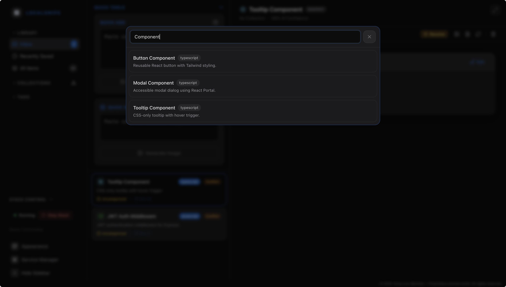
      <p align="center"><sub><strong>Paleta de Comandos</strong> — Búsqueda rápida global</sub></p>
    </td>
    <td width="40%" valign="center">
      <blockquote><strong>Característica principal para usuarios avanzados</strong></blockquote>
      <br>
      <table
        cellspacing="0"
        cellpadding="8"
        style="
          border:1px solid rgba(127,127,127,.35);
          border-radius:12px;
          overflow:hidden;
          border-collapse:separate;
          border-spacing:0;
        "
      >
        <tr>
          <td style="padding:10px 12px; border-bottom:1px solid rgba(127,127,127,.18); white-space:nowrap;">
            ⌨️ <strong>Acceso Global</strong>
          </td>
          <td style="padding:10px 12px; border-bottom:1px solid rgba(127,127,127,.18);">
            ⌘K en cualquier lugar
          </td>
        </tr>
        <tr>
          <td style="padding:10px 12px; border-bottom:1px solid rgba(127,127,127,.18); white-space:nowrap;">
            🔍 <strong>Búsqueda Inteligente</strong>
          </td>
          <td style="padding:10px 12px; border-bottom:1px solid rgba(127,127,127,.18);">
            Filtrado en tiempo real
          </td>
        </tr>
        <tr>
          <td style="padding:10px 12px; white-space:nowrap;">
            🚀 <strong>Navegación Directa</strong>
          </td>
          <td style="padding:10px 12px;">
            Ir a cualquier snippet
          </td>
        </tr>
      </table>
    </td>
  </tr>
</table>

---

### 7. Configuración de Apariencia

<table>
  <tr>
    <td width="60%" valign="top">
      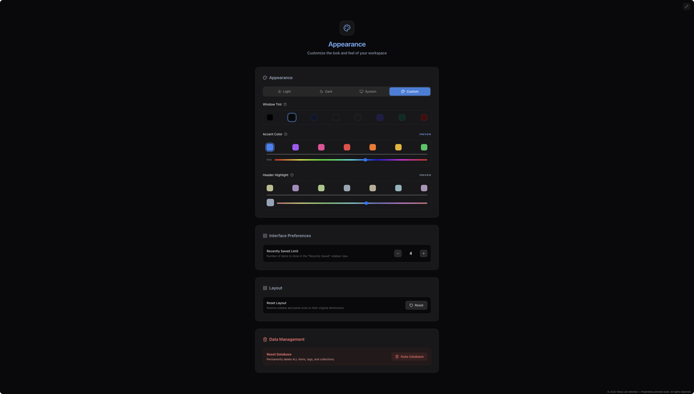
      <p align="center"><sub><strong>Panel de Apariencia</strong> — Personalización completa</sub></p>
    </td>
    <td width="40%" valign="center">
      <table
        cellspacing="0"
        cellpadding="8"
        style="
          border:1px solid rgba(127,127,127,.35);
          border-radius:12px;
          overflow:hidden;
          border-collapse:separate;
          border-spacing:0;
        "
      >
        <tr>
          <td style="padding:10px 12px; border-bottom:1px solid rgba(127,127,127,.18); white-space:nowrap;">
            🌓 <strong>Modos de Tema</strong>
          </td>
          <td style="padding:10px 12px; border-bottom:1px solid rgba(127,127,127,.18);">
            Claro, Oscuro, Sistema, Custom
          </td>
        </tr>
        <tr>
          <td style="padding:10px 12px; border-bottom:1px solid rgba(127,127,127,.18); white-space:nowrap;">
            🎨 <strong>Color de Marca</strong>
          </td>
          <td style="padding:10px 12px; border-bottom:1px solid rgba(127,127,127,.18);">
            Deslizadores de Tono/Saturación
          </td>
        </tr>
        <tr>
          <td style="padding:10px 12px; border-bottom:1px solid rgba(127,127,127,.18); white-space:nowrap;">
            🖼️ <strong>Color de Superficie</strong>
          </td>
          <td style="padding:10px 12px; border-bottom:1px solid rgba(127,127,127,.18);">
            Fondos de paneles
          </td>
        </tr>
        <tr>
          <td style="padding:10px 12px; border-bottom:1px solid rgba(127,127,127,.18); white-space:nowrap;">
            ✨ <strong>Window Tint</strong>
          </td>
          <td style="padding:10px 12px; border-bottom:1px solid rgba(127,127,127,.18);">
            Superposición de color de marca
          </td>
        </tr>
        <tr>
          <td style="padding:10px 12px; white-space:nowrap;">
            🔢 <strong>Recently Saved Limit</strong>
          </td>
          <td style="padding:10px 12px;">
            Elementos en vista Recientes
          </td>
        </tr>
      </table>
    </td>
  </tr>
</table>

---

### 8. Gestor de Servicios (Vista Previa - Control del Stack)

<table>
  <tr>
    <td width="60%" valign="top">
      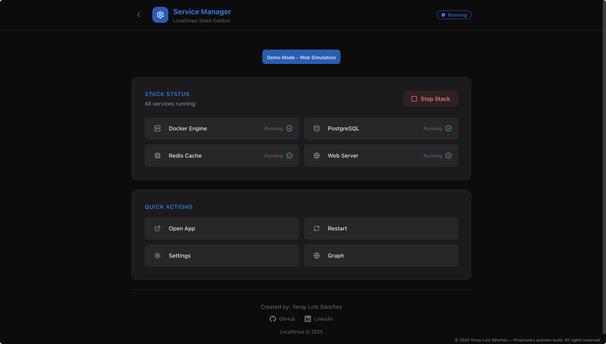
      <p align="center"><sub><strong>Gestor de Servicios</strong> — Simulación de control del stack</sub></p>
    </td>
    <td width="40%" valign="center">
      <table
        cellspacing="0"
        cellpadding="8"
        style="
          border:1px solid rgba(127,127,127,.35);
          border-radius:12px;
          overflow:hidden;
          border-collapse:separate;
          border-spacing:0;
        "
      >
        <tr>
          <td style="padding:10px 12px; border-bottom:1px solid rgba(127,127,127,.18); white-space:nowrap;">
            ▶️ <strong>Operaciones de Stack</strong>
          </td>
          <td style="padding:10px 12px; border-bottom:1px solid rgba(127,127,127,.18);">
            Iniciar / Detener stack
          </td>
        </tr>
        <tr>
          <td style="padding:10px 12px; border-bottom:1px solid rgba(127,127,127,.18); white-space:nowrap;">
            🟢 <strong>Estado</strong>
          </td>
          <td style="padding:10px 12px; border-bottom:1px solid rgba(127,127,127,.18);">
            Docker, PostgreSQL, Redis, Web
          </td>
        </tr>
        <tr>
          <td style="padding:10px 12px; white-space:nowrap;">
            ⚡ <strong>Acciones Rápidas</strong>
          </td>
          <td style="padding:10px 12px;">
            Abrir App, Reiniciar, Grafo
          </td>
        </tr>
      </table>
    </td>

  </tr>
</table>

---

### 9. Resolución de Conflictos

<table>
  <tr>
    <td width="60%" valign="top">
      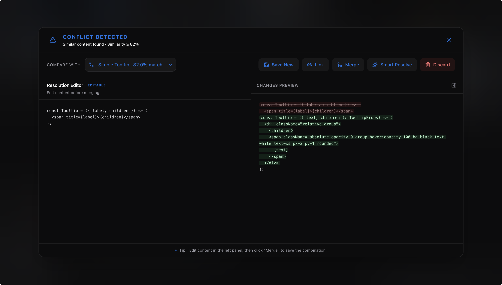
      <p align="center"><sub><strong>Resolución de Conflictos</strong> — Interfaz visual de diferencias</sub></p>
    </td>
    <td width="40%" valign="center">
      <table
        align="center"
        cellspacing="0"
        cellpadding="8"
        style="
          margin:0 auto;
          border:1px solid rgba(127,127,127,.35);
          border-radius:12px;
          overflow:hidden;
          border-collapse:separate;
          border-spacing:0;
        "
      >
        <tr>
          <td style="padding:10px 12px; border-bottom:1px solid rgba(127,127,127,.18); white-space:nowrap;">
            ➕ <strong>Save New</strong>
          </td>
          <td style="padding:10px 12px; border-bottom:1px solid rgba(127,127,127,.18);">
            Mantener ambos elementos
          </td>
        </tr>
        <tr>
          <td style="padding:10px 12px; border-bottom:1px solid rgba(127,127,127,.18); white-space:nowrap;">
            🔗 <strong>Link</strong>
          </td>
          <td style="padding:10px 12px; border-bottom:1px solid rgba(127,127,127,.18);">
            Crear referencia
          </td>
        </tr>
        <tr>
          <td style="padding:10px 12px; border-bottom:1px solid rgba(127,127,127,.18); white-space:nowrap;">
            🔀 <strong>Merge</strong>
          </td>
          <td style="padding:10px 12px; border-bottom:1px solid rgba(127,127,127,.18);">
            Combinar con edición
          </td>
        </tr>
        <tr>
          <td style="padding:10px 12px; border-bottom:1px solid rgba(127,127,127,.18); white-space:nowrap;">
            🧠 <strong>Smart Resolve</strong>
          </td>
          <td style="padding:10px 12px; border-bottom:1px solid rgba(127,127,127,.18);">
            Fusión asistida por IA
          </td>
        </tr>
        <tr>
          <td style="padding:10px 12px; white-space:nowrap;">
            🗑️ <strong>Discard</strong>
          </td>
          <td style="padding:10px 12px;">
            Eliminar nuevo elemento
          </td>
        </tr>
      </table>
      <p style="margin-top:6px; margin-bottom:0;" align="center">
        <sub>Editor: Panel Editable · Vista Previa de Diferencias · Deshacer</sub>
      </p>
    </td>
  </tr>
</table>

---

### 10. Soporte Móvil

Esta vista previa incluye un **diseño responsive mínimo** optimizado para teléfonos y tablets.

<table align="center">
  <tr>
    <td align="center">
      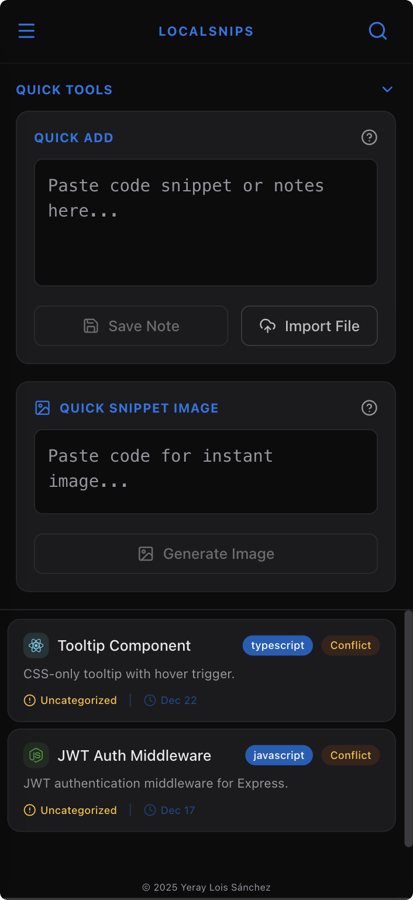
      <br/><sub><strong>Página Principal</strong></sub>
    </td>
    <td align="center">
      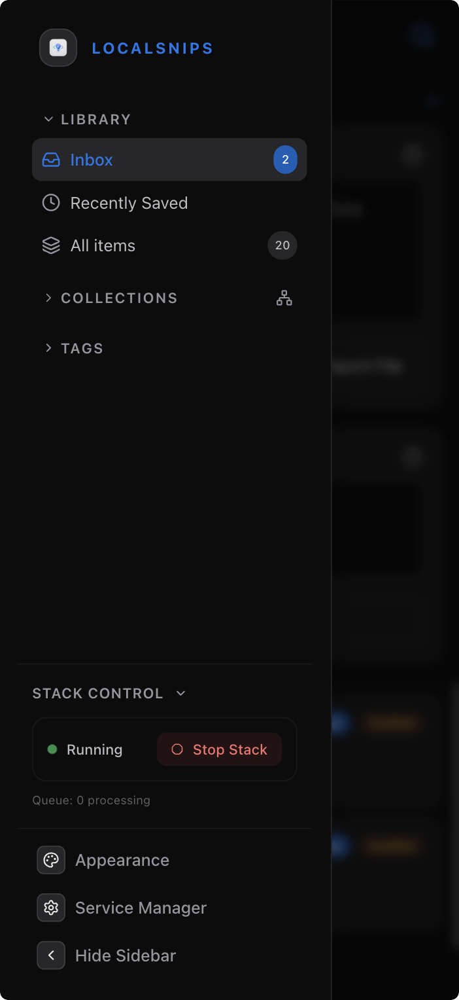
      <br/><sub><strong>Barra Lateral</strong></sub>
    </td>
    <td align="center">
      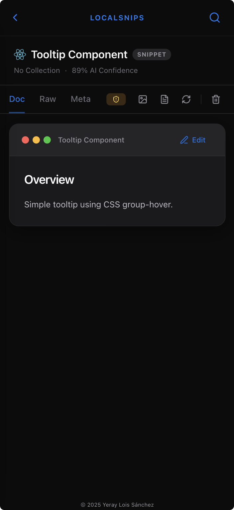
      <br/><sub><strong>Detalle del Elemento</strong></sub>
    </td>
  </tr>
</table>

<p align="center">
  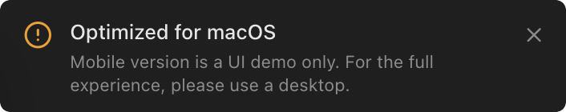
  <br/><sub><strong>Banner Vista Móvil</strong></sub>
</p>

> **Nota:** LocalSnips es un producto diseñado para macOS. La vista móvil proporciona un resumen rápido con un flujo simplificado de una sola columna y navegación por menú lateral.

---

## Limitaciones

> [!NOTE]
> Esta es una **compilación de vista previa estática** diseñada solo para fines de demostración.

<table width="100%" cellspacing="0" cellpadding="10">
  <tr>
    <td width="72%" valign="middle" align="left">
      <table
        cellspacing="0"
        cellpadding="8"
        style="
          width:100%;
          border:1px solid rgba(127,127,127,.35);
          border-radius:12px;
          overflow:hidden;
          border-collapse:separate;
          border-spacing:0;
        "
      >
        <tr>
          <td align="center" width="80" style="padding:10px 12px; border-bottom:1px solid rgba(127,127,127,.18);">
            💾
          </td>
          <td style="padding:10px 12px; border-bottom:1px solid rgba(127,127,127,.18); white-space:nowrap;">
            <strong>Sin Persistencia</strong>
          </td>
          <td style="padding:10px 12px; border-bottom:1px solid rgba(127,127,127,.18);">
            Actualizar puede reiniciar el estado de la demo
          </td>
        </tr>
        <tr>
          <td align="center" style="padding:10px 12px; border-bottom:1px solid rgba(127,127,127,.18);">
            🤖
          </td>
          <td style="padding:10px 12px; border-bottom:1px solid rgba(127,127,127,.18); white-space:nowrap;">
            <strong>Sin Procesamiento IA</strong>
          </td>
          <td style="padding:10px 12px; border-bottom:1px solid rgba(127,127,127,.18);">
            Las funciones de IA están simuladas con datos de ejemplo
          </td>
        </tr>
        <tr>
          <td align="center" style="padding:10px 12px;">
            🐳
          </td>
          <td style="padding:10px 12px; white-space:nowrap;">
            <strong>Sin Backend</strong>
          </td>
          <td style="padding:10px 12px;">
            Las interacciones con Docker/PostgreSQL/Redis están simuladas
          </td>
        </tr>
      </table>
    </td>
    <td width="28%" valign="middle" align="center">
      
      <br>
      <sub>
        ¿Quieres evaluar la app completa de macOS?<br>
        <a href="mailto:yerayloissanchez@gmail.com"><strong>Solicitar acceso →</strong></a>
      </sub>
    </td>
  </tr>
</table>

---

## Requisitos Previos

> [!IMPORTANT]
> Estos requisitos aplican a la **aplicación completa de macOS**, no a esta vista previa estática.

<p align="center">
  
  
  
</p>

---

<details open>
<summary><strong>🖥️ Requisitos del Sistema</strong></summary>
<br>
<table
  align="center"
  cellspacing="0"
  cellpadding="8"
  style="
    border:1px solid rgba(127,127,127,.35);
    border-radius:12px;
    overflow:hidden;
    border-collapse:separate;
    border-spacing:0;
  "
>
  <tr>
    <td align="center" width="60" style="padding:10px 12px; border-bottom:1px solid rgba(127,127,127,.18);">
      🍎
    </td>
    <td style="padding:10px 12px; border-bottom:1px solid rgba(127,127,127,.18);">
      <strong>Versión del SO</strong>
    </td>
    <td style="padding:10px 12px; border-bottom:1px solid rgba(127,127,127,.18);">
      macOS 13.0 (Ventura) o posterior
    </td>
  </tr>
  <tr>
    <td align="center" style="padding:10px 12px; border-bottom:1px solid rgba(127,127,127,.18);">
      ⚡
    </td>
    <td style="padding:10px 12px; border-bottom:1px solid rgba(127,127,127,.18);">
      <strong>Arquitectura</strong>
    </td>
    <td style="padding:10px 12px; border-bottom:1px solid rgba(127,127,127,.18);">
      Apple Silicon (M1/M2/M3) o Intel Core
    </td>
  </tr>
  <tr>
    <td align="center" style="padding:10px 12px; border-bottom:1px solid rgba(127,127,127,.18);">
      🧠
    </td>
    <td style="padding:10px 12px; border-bottom:1px solid rgba(127,127,127,.18);">
      <strong>RAM</strong>
    </td>
    <td style="padding:10px 12px; border-bottom:1px solid rgba(127,127,127,.18);">
      4GB mínimo · 8GB recomendado
    </td>
  </tr>
  <tr>
    <td align="center" style="padding:10px 12px; border-bottom:1px solid rgba(127,127,127,.18);">
      💿
    </td>
    <td style="padding:10px 12px; border-bottom:1px solid rgba(127,127,127,.18);">
      <strong>Espacio en Disco</strong>
    </td>
    <td style="padding:10px 12px; border-bottom:1px solid rgba(127,127,127,.18);">
      ~2GB libre
    </td>
  </tr>
  <tr>
    <td align="center" style="padding:10px 12px;">
      🐳
    </td>
    <td style="padding:10px 12px;">
      <strong>Entorno de Contenedores</strong>
    </td>
    <td style="padding:10px 12px;">
      Docker Desktop (requerido)
    </td>
  </tr>
</table>

</details>

---

<details open>
<summary><strong>🌐 Puertos de Red</strong></summary>
<br>

<table width="100%" cellspacing="0" cellpadding="10">
  <tr>
    <td width="62%" valign="top" align="left">
      <table
        cellspacing="0"
        cellpadding="8"
        style="
          width:100%;
          border:1px solid rgba(127,127,127,.35);
          border-radius:12px;
          overflow:hidden;
          border-collapse:separate;
          border-spacing:0;
        "
      >
        <tr>
          <th style="padding:10px 12px; border-bottom:1px solid rgba(127,127,127,.25); text-align:center; vertical-align:middle;">
            Servicio
          </th>
          <th style="padding:10px 12px; border-bottom:1px solid rgba(127,127,127,.25); text-align:center; vertical-align:middle;">
            Puerto Predeterminado
          </th>
          <th style="padding:10px 12px; border-bottom:1px solid rgba(127,127,127,.25); text-align:center; vertical-align:middle;">
            Protocolo
          </th>
          <th style="padding:10px 12px; border-bottom:1px solid rgba(127,127,127,.25); text-align:center; vertical-align:middle;">
            Variable
          </th>
        </tr>
        <tr>
          <td style="padding:10px 12px; border-bottom:1px solid rgba(127,127,127,.18); white-space:nowrap;">
            🌐 Web UI / API
          </td>
          <td style="padding:10px 12px; border-bottom:1px solid rgba(127,127,127,.18); text-align:center;">
            <code>3030</code>
          </td>
          <td style="padding:10px 12px; border-bottom:1px solid rgba(127,127,127,.18); text-align:center;">
            HTTP
          </td>
          <td style="padding:10px 12px; border-bottom:1px solid rgba(127,127,127,.18); text-align:center;">
            <code>WEB_PORT</code>
          </td>
        </tr>
        <tr>
          <td style="padding:10px 12px; border-bottom:1px solid rgba(127,127,127,.18); white-space:nowrap;">
            🐘 PostgreSQL
          </td>
          <td style="padding:10px 12px; border-bottom:1px solid rgba(127,127,127,.18); text-align:center;">
            <code>54321</code>
          </td>
          <td style="padding:10px 12px; border-bottom:1px solid rgba(127,127,127,.18); text-align:center;">
            TCP
          </td>
          <td style="padding:10px 12px; border-bottom:1px solid rgba(127,127,127,.18); text-align:center;">
            <code>DB_PORT</code>
          </td>
        </tr>
        <tr>
          <td style="padding:10px 12px; white-space:nowrap;">
            ⚡ Redis
          </td>
          <td style="padding:10px 12px; text-align:center;">
            <code>63791</code>
          </td>
          <td style="padding:10px 12px; text-align:center;">
            TCP
          </td>
          <td style="padding:10px 12px; text-align:center;">
            <code>REDIS_PORT</code>
          </td>
        </tr>
      </table>
    </td>
    <td width="38%" valign="top" align="center">
      <div
        style="
          background:#1e1e1e;
          border-radius:12px;
          padding:14px;
          overflow:hidden;
          width:100%;
          max-width:420px;
          text-align:left;
        "
      >

```env
WEB_PORT=3030      # Web UI / API (HTTP)
DB_PORT=54321      # PostgreSQL (TCP)
REDIS_PORT=63791   # Redis (TCP)
```

  </div>
  <br>
  <sub>Todos los puertos son <strong>configurables vía archivo <code>.env</code></strong></sub>
</td>
</tr>
</table>

</details>

---

<details open>
<summary><strong>🤖 Configuración de Proveedores de IA</strong></summary>
<br>

LocalSnips soporta **múltiples proveedores de IA** con detección automática:

<table
  align="center"
  cellspacing="0"
  cellpadding="8"
  style="
    border:1px solid rgba(127,127,127,.35);
    border-radius:12px;
    overflow:hidden;
    border-collapse:separate;
    border-spacing:0;
  "
>
  <tr>
    <th style="padding:10px 12px; border-bottom:1px solid rgba(127,127,127,.25); text-align:center; vertical-align:middle;">
      Proveedor
    </th>
    <th style="padding:10px 12px; border-bottom:1px solid rgba(127,127,127,.25); text-align:center; vertical-align:middle;">
      Variable de Entorno
    </th>
    <th style="padding:10px 12px; border-bottom:1px solid rgba(127,127,127,.25); text-align:center; vertical-align:middle;">
      Modelos
    </th>
  </tr>
  <tr>
    <td align="center" style="padding:10px 12px; border-bottom:1px solid rgba(127,127,127,.18);">
      
    </td>
    <td style="padding:10px 12px; border-bottom:1px solid rgba(127,127,127,.18); text-align:center;">
      <code>OPENAI_API_KEY</code>
    </td>
    <td style="padding:10px 12px; border-bottom:1px solid rgba(127,127,127,.18);">
      GPT-4, GPT-4o-mini, text-embedding-3-small
    </td>
  </tr>
  <tr>
    <td align="center" style="padding:10px 12px; border-bottom:1px solid rgba(127,127,127,.18);">
      
    </td>
    <td style="padding:10px 12px; border-bottom:1px solid rgba(127,127,127,.18); text-align:center;">
      <code>GEMINI_API_KEY</code>
    </td>
    <td style="padding:10px 12px; border-bottom:1px solid rgba(127,127,127,.18);">
      Gemini Pro, Gemini Flash
    </td>
  </tr>
  <tr>
    <td align="center" style="padding:10px 12px;">
      
    </td>
    <td style="padding:10px 12px; text-align:center;">
      <code>DEEPSEEK_API_KEY</code>
    </td>
    <td style="padding:10px 12px;">
      DeepSeek-V2, DeepSeek-Coder
    </td>
  </tr>
</table>
</details>

---

<details open>
<summary><strong>📋 Variables de Entorno Adicionales</strong></summary>
<br>
<div style="background: #1e1e1e; border-radius: 12px; padding: 16px; overflow: hidden;">

```env
# =============================================================================
# DOCKER HOST PORTS (OPTIONAL)
# =============================================================================
# Customize the ports exposed to your host machine.
# If not set, these defaults are used:

WEB_PORT=3030
DB_PORT=54321
REDIS_PORT=63791

# =============================================================================
# DATA CONNECTIONS
# =============================================================================
# DATABASE
# Note: When running with Docker Compose, this is injected automatically.
# Only set this if you are using an external DB or need to override the default.

# Default (Docker): postgresql://localsnips:localsnips@db:5432/localsnips?schema=public
DATABASE_URL="postgresql://localsnips:localsnips@db:5432/localsnips?schema=public"

# REDIS
# Note: When running with Docker Compose, this is injected automatically.

# Default (Docker): redis://redis:6379
REDIS_URL="redis://redis:6379"

# =============================================================================
# AI PROVIDER CONFIGURATION (OPTIONAL)
# =============================================================================
# Set ACTIVE_AI_PROVIDER to choose which provider to use.
# Supported: openai, gemini, deepseek
# If not set, will auto-detect based on which API key is available.

ACTIVE_AI_PROVIDER=openai

# OPENAI
OPENAI_API_KEY=sk-your-openai-key-here

# GOOGLE GEMINI
GEMINI_API_KEY=AIza-your-gemini-key-here

# DEEPSEEK
DEEPSEEK_API_KEY=sk-your-deepseek-key-here

```

</div>
</details>

---

<details open>
<summary><strong>📁 Sistema de Archivos y Permisos</strong></summary>
<br>

<table width="100%" cellspacing="0" cellpadding="10">
  <tr>
    <td width="66%" valign="middle" align="left">
      <table
        cellspacing="0"
        cellpadding="8"
        style="
          width:100%;
          border:1px solid rgba(127,127,127,.35);
          border-radius:12px;
          overflow:hidden;
          border-collapse:separate;
          border-spacing:0;
        "
      >
        <tr>
          <th style="padding:10px 12px; border-bottom:1px solid rgba(127,127,127,.25); text-align:center; vertical-align:middle;">
            Ruta
          </th>
          <th style="padding:10px 12px; border-bottom:1px solid rgba(127,127,127,.25); text-align:center; vertical-align:middle;">
            Propósito
          </th>
        </tr>
        <tr>
          <td style="padding:10px 12px; border-bottom:1px solid rgba(127,127,127,.18); white-space:nowrap; text-align:center;">
            <code>~/Library/Application Support/LocalSnips/stack</code>
          </td>
          <td style="padding:10px 12px; border-bottom:1px solid rgba(127,127,127,.18); text-align:center;">
            Configuración del backend y contexto Docker
          </td>
        </tr>
        <tr>
          <td style="padding:10px 12px; white-space:nowrap; text-align:center;">
            <code>~/.docker/run/docker.sock</code>
          </td>
          <td style="padding:10px 12px; text-align:center;">
            Socket del motor Docker
          </td>
        </tr>
      </table>
    </td>
    <td width="34%" valign="middle" align="center">
      <table
        cellspacing="0"
        cellpadding="10"
        style="
          width:100%;
          max-width:420px;
          border:1px solid rgba(127,127,127,.35);
          border-radius:12px;
          overflow:hidden;
          border-collapse:separate;
          border-spacing:0;
        "
      >
        <tr>
          <td align="center" style="padding:12px;">
            <strong>💡 CONSEJO</strong><br>
            <br>
            <sub>
              La app funciona completamente dentro de tu ámbito de usuario (<code>~/</code>).<br>
              <strong>No requiere acceso root.</strong>
            </sub>
          </td>
        </tr>
      </table>
    </td>
  </tr>
</table>
</details>

---

## Acerca de Este Repositorio

Este repositorio aloja la **compilación de exportación estática** de LocalSnips — una versión compilada, solo del lado del cliente de la interfaz web diseñada para **demostración pública** sin requerir ninguna infraestructura backend.

<table width="100%" cellspacing="0" cellpadding="10">
  <tr>
    <td width="50%" valign="top">
      <table
        cellspacing="0"
        cellpadding="8"
        style="
          width:100%;
          border:1px solid rgba(127,127,127,.35);
          border-radius:12px;
          overflow:hidden;
          border-collapse:separate;
          border-spacing:0;
        "
      >
        <tr>
          <th colspan="2" style="padding:10px 12px; border-bottom:1px solid rgba(127,127,127,.25); text-align:center;">
            ✅ <strong>Incluido</strong>
          </th>
        </tr>
        <tr>
          <td style="padding:10px 12px; border-bottom:1px solid rgba(127,127,127,.18);">📦 Recursos Estáticos</td>
          <td style="padding:10px 12px; border-bottom:1px solid rgba(127,127,127,.18);">Artefactos de compilación HTML, CSS, JS</td>
        </tr>
        <tr>
          <td style="padding:10px 12px; border-bottom:1px solid rgba(127,127,127,.18);">🎨 Flujos UI/UX</td>
          <td style="padding:10px 12px; border-bottom:1px solid rgba(127,127,127,.18);">Demos de interacción completas</td>
        </tr>
        <tr>
          <td style="padding:10px 12px;">🧪 Datos de Prueba</td>
          <td style="padding:10px 12px;">Snippets y respuestas simuladas</td>
        </tr>
      </table>
    </td>
    <td width="50%" valign="top">
      <table
        cellspacing="0"
        cellpadding="8"
        style="
          width:100%;
          border:1px solid rgba(127,127,127,.35);
          border-radius:12px;
          overflow:hidden;
          border-collapse:separate;
          border-spacing:0;
        "
      >
        <tr>
          <th colspan="2" style="padding:10px 12px; border-bottom:1px solid rgba(127,127,127,.25); text-align:center;">
            ❌ <strong>No Incluido</strong>
          </th>
        </tr>
        <tr>
          <td style="padding:10px 12px; border-bottom:1px solid rgba(127,127,127,.18);">🔒 Código Fuente</td>
          <td style="padding:10px 12px; border-bottom:1px solid rgba(127,127,127,.18);">Lógica de aplicación propietaria</td>
        </tr>
        <tr>
          <td style="padding:10px 12px; border-bottom:1px solid rgba(127,127,127,.18);">🐳 Infraestructura Backend</td>
          <td style="padding:10px 12px; border-bottom:1px solid rgba(127,127,127,.18);">Docker, PostgreSQL, Redis</td>
        </tr>
        <tr>
          <td style="padding:10px 12px;">⚙️ Config de Producción</td>
          <td style="padding:10px 12px;">Claves API, secretos, archivos env</td>
        </tr>
      </table>
    </td>
  </tr>
</table>

> [!NOTE]
> Esta vista previa funciona **completamente del lado del cliente** usando datos simulados. No se requieren ni contactan servicios backend, bases de datos o APIs externas.

<p align="center">
  
  
  
</p>

---

## Demo en Vivo

<table align="center" width="100%" cellspacing="0" cellpadding="10">
  <tr>
    <td width="66%" valign="middle" align="center">
      <table
        align="center"
        cellspacing="0"
        cellpadding="8"
        style="
          width:100%;
          margin:0 auto;
          border:1px solid rgba(127,127,127,.35);
          border-radius:12px;
          overflow:hidden;
          border-collapse:separate;
          border-spacing:0;
        "
      >
        <tr>
          <td align="center" style="padding:10px 12px; border-bottom:1px solid rgba(127,127,127,.18); white-space:nowrap;">
            <strong>🔗 URL</strong>
          </td>
          <td style="padding:10px 12px; border-bottom:1px solid rgba(127,127,127,.18);">
            <a href="https://yeraylois.github.io/localsnips-preview/">yeraylois.github.io/localsnips-preview</a>
          </td>
        </tr>
        <tr>
          <td align="center" style="padding:10px 12px; border-bottom:1px solid rgba(127,127,127,.18); white-space:nowrap;">
            <strong>📧 Contacto</strong>
          </td>
          <td style="padding:10px 12px; border-bottom:1px solid rgba(127,127,127,.18);">
            <a href="mailto:yerayloissanchez@gmail.com">yerayloissanchez@gmail.com</a>
          </td>
        </tr>
        <tr>
          <td align="center" style="padding:10px 12px; border-bottom:1px solid rgba(127,127,127,.18); white-space:nowrap;">
            <strong>💼 LinkedIn</strong>
          </td>
          <td style="padding:10px 12px; border-bottom:1px solid rgba(127,127,127,.18);">
            <a href="https://linkedin.com/in/yeray-lois">linkedin.com/in/yeray-lois</a>
          </td>
        </tr>
        <tr>
          <td align="center" style="padding:10px 12px; white-space:nowrap;">
            <strong>🐙 GitHub</strong>
          </td>
          <td style="padding:10px 12px;">
            <a href="https://github.com/yeraylois">github.com/yeraylois</a>
          </td>
        </tr>
      </table>
    </td>
    <td width="34%" valign="middle" align="center">
      <a href="https://yeraylois.github.io/localsnips-preview/">
        
      </a>
      <br>
      <sub>Alojado en GitHub Pages<br>Compilación estática · Sin backend</sub>
    </td>
  </tr>
</table>

---

## Propiedad y Licencia

> [!CAUTION]
> Este repositorio es **propietario**. No se otorga ninguna licencia para usar, copiar, modificar, distribuir, sublicenciar o crear trabajos derivados de este repositorio o su contenido.

<details>
<summary><strong>📜 Términos de Licencia</strong></summary>
<br>

<table
  align="center"
  cellspacing="0"
  cellpadding="8"
  style="
    border:1px solid rgba(127,127,127,.35);
    border-radius:12px;
    overflow:hidden;
    border-collapse:separate;
    border-spacing:0;
  "
  >
  <tr>
    <th style="padding:10px 12px; border-bottom:1px solid rgba(127,127,127,.25); text-align:center; vertical-align:middle;">
      Restricción
    </th>
    <th style="padding:10px 12px; border-bottom:1px solid rgba(127,127,127,.25); text-align:center; vertical-align:middle;">
      Detalles
    </th>
  </tr>
  <tr>
    <td style="padding:10px 12px; border-bottom:1px solid rgba(127,127,127,.18); white-space:nowrap; text-align:center;">
      ❌ <strong>Prohibida redistribución</strong>
    </td>
    <td style="padding:10px 12px; border-bottom:1px solid rgba(127,127,127,.18);">
      No puede compartir ni redistribuir este software
    </td>
  </tr>
  <tr>
    <td style="padding:10px 12px; border-bottom:1px solid rgba(127,127,127,.18); white-space:nowrap; text-align:center;">
      ❌ <strong>Prohibida modificación</strong>
    </td>
    <td style="padding:10px 12px; border-bottom:1px solid rgba(127,127,127,.18);">
      No puede modificar ni crear trabajos derivados
    </td>
  </tr>
  <tr>
    <td style="padding:10px 12px; border-bottom:1px solid rgba(127,127,127,.18); white-space:nowrap; text-align:center;">
      ❌ <strong>Prohibido uso comercial</strong>
    </td>
    <td style="padding:10px 12px; border-bottom:1px solid rgba(127,127,127,.18);">
      El uso comercial requiere autorización explícita
    </td>
  </tr>
  <tr>
    <td style="padding:10px 12px; white-space:nowrap; text-align:center;">
      ❌ <strong>Prohibida sublicencia</strong>
    </td>
    <td style="padding:10px 12px;">
      No puede otorgar licencias a terceros
    </td>
  </tr>
</table>
<br>
</details>

<p align="center">
  <strong>¿Interesado en licenciamiento, asociación o acceso de evaluación?</strong>
</p>

<p align="center">
  <a href="mailto:yerayloissanchez@gmail.com">
    
  </a>
</p>

<table align="center" width="100%">
  <tr>
    <td align="center">
      <strong>Copyright © 2026 Yeray Lois Sánchez. Todos los Derechos Reservados.</strong>
    </td>
  </tr>
</table>

---

## Aviso de Propiedad Intelectual

> [!WARNING]<br>
>
> > **LocalSnips** y todos los nombres, logos, diseños UI/UX, código fuente y documentación asociados son **propiedad intelectual exclusiva** de Yeray Lois Sánchez. Todos los derechos reservados bajo las leyes de derechos de autor y propiedad intelectual aplicables.

<table width="100%" cellspacing="0" cellpadding="10">
  <tr>
    <td width="72%" valign="top" align="left">
      <table
        cellspacing="0"
        cellpadding="8"
        style="
          width:100%;
          border:1px solid rgba(127,127,127,.35);
          border-radius:12px;
          overflow:hidden;
          border-collapse:separate;
          border-spacing:0;
        "
      >
        <tr>
          <th style="padding:10px 12px; border-bottom:1px solid rgba(127,127,127,.25); text-align:center; vertical-align:middle;">
            Activo Protegido
          </th>
          <th style="padding:10px 12px; border-bottom:1px solid rgba(127,127,127,.25); text-align:center; vertical-align:middle;">
            Tipo de Protección
          </th>
          <th style="padding:10px 12px; border-bottom:1px solid rgba(127,127,127,.25); text-align:center; vertical-align:middle;">
            Estado
          </th>
        </tr>
        <tr>
          <td style="padding:10px 12px; border-bottom:1px solid rgba(127,127,127,.18);">
            Nombre del Producto "LocalSnips"
          </td>
          <td style="padding:10px 12px; border-bottom:1px solid rgba(127,127,127,.18);">
            Derechos de Uso Común
          </td>
          <td style="padding:10px 12px; border-bottom:1px solid rgba(127,127,127,.18); text-align:center; white-space:nowrap;">
            🔒 Protegido
          </td>
        </tr>
        <tr>
          <td style="padding:10px 12px; border-bottom:1px solid rgba(127,127,127,.18);">
            Logo e Identidad Visual
          </td>
          <td style="padding:10px 12px; border-bottom:1px solid rgba(127,127,127,.18);">
            Derechos de Autor
          </td>
          <td style="padding:10px 12px; border-bottom:1px solid rgba(127,127,127,.18); text-align:center; white-space:nowrap;">
            🔒 Protegido
          </td>
        </tr>
        <tr>
          <td style="padding:10px 12px; border-bottom:1px solid rgba(127,127,127,.18);">
            Patrones de Diseño UI/UX
          </td>
          <td style="padding:10px 12px; border-bottom:1px solid rgba(127,127,127,.18);">
            Derechos de Autor / Trade Dress
          </td>
          <td style="padding:10px 12px; border-bottom:1px solid rgba(127,127,127,.18); text-align:center; white-space:nowrap;">
            🔒 Protegido
          </td>
        </tr>
        <tr>
          <td style="padding:10px 12px; border-bottom:1px solid rgba(127,127,127,.18);">
            Código Fuente y Arquitectura
          </td>
          <td style="padding:10px 12px; border-bottom:1px solid rgba(127,127,127,.18);">
            Derechos de Autor
          </td>
          <td style="padding:10px 12px; border-bottom:1px solid rgba(127,127,127,.18); text-align:center; white-space:nowrap;">
            🔒 Protegido
          </td>
        </tr>
        <tr>
          <td style="padding:10px 12px;">
            Documentación y Capturas de Pantalla
          </td>
          <td style="padding:10px 12px;">
            Derechos de Autor
          </td>
          <td style="padding:10px 12px; text-align:center; white-space:nowrap;">
            🔒 Protegido
          </td>
        </tr>
      </table>
    </td>
    <td width="28%" valign="middle" align="center">
      <p align="center" style="margin:0;">
        <br>
        <br>
        
      </p>
    </td>
  </tr>
</table>

<details>
<summary><strong>⚖️ Aviso Legal</strong></summary>
<br>

Este repositorio y su contenido constituyen **arte previo** y **evidencia de autoría** desde la fecha de publicación mostrada anteriormente.

**Prohibido sin autorización escrita:**

- Copiar, reproducir o redistribuir cualquier parte de este trabajo
- Crear trabajos derivados basados en este diseño o código
- Usar el nombre o marca "LocalSnips" para cualquier propósito
- Ingeniería inversa o descompilar la aplicación
- Explotación comercial en cualquier forma

**Aplicación:**
El autor se reserva el derecho de perseguir todos los recursos legales disponibles contra el uso no autorizado, incluyendo pero no limitado a: reclamaciones por infracción de derechos de autor, reclamaciones por competencia desleal y solicitudes de medidas cautelares.

**Preservación de Evidencia:**
Todos los commits, marcas de tiempo e historial de versiones en este repositorio sirven como evidencia documental de autoría y fechas de publicación.

</details>

---

<br>
<p align="center">
  
</p>

<p align="center">
  <sub><strong>LocalSnips © 2026 Yeray Lois Sánchez</strong></sub><br/>
  <sub>Compilación de vista previa propietaria · Todos los Derechos Reservados</sub><br/>
  <sub><em>Primera publicación: Enero 2026 · Este documento sirve como prueba de arte previo</em></sub>
</p>
